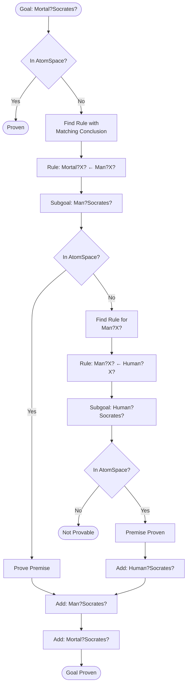

# NodeCog Component Interactions and Data Flows

## Overview

This document details the interactions between NodeCog components, data flows, and communication patterns using Mermaid diagrams and detailed descriptions.

## Table of Contents

- [System Startup Flow](#system-startup-flow)
- [Knowledge Creation Flow](#knowledge-creation-flow)
- [Attention Dynamics Flow](#attention-dynamics-flow)
- [Agent Orchestration Flow](#agent-orchestration-flow)
- [Reasoning Pipeline Flow](#reasoning-pipeline-flow)
- [Module Loading Flow](#module-loading-flow)
- [Distributed Synchronization Flow](#distributed-synchronization-flow)
- [Cognitive Synergy Engine Flow](#cognitive-synergy-engine-flow)
- [Component Communication Patterns](#component-communication-patterns)

## System Startup Flow

### Initialization Sequence

```mermaid
sequenceDiagram
    participant Main as Application
    participant System as Cognitive System
    participant AS as AtomSpace
    participant AB as Attention Bank
    participant Orch as Orchestrator
    participant Loop as Cognitive Loop
    
    Main->>System: createCognitiveSystem(config)
    System->>AS: new AtomSpace(config.atomspace)
    AS-->>System: atomspace instance
    
    System->>AB: new AttentionBank(atomspace, config.attention)
    AB-->>System: attention bank instance
    
    System->>Orch: new AgentOrchestrator(config.orchestrator)
    Orch-->>System: orchestrator instance
    
    System->>Loop: new CognitiveLoop(atomspace, ab, orch, config.loop)
    Loop-->>System: cognitive loop instance
    
    System-->>Main: cognitive system
    
    Main->>Loop: start()
    activate Loop
    Loop->>Loop: begin autonomous operation
    Loop-->>Main: started
```

### Component Initialization Details


## Knowledge Creation Flow

### Adding Knowledge to AtomSpace


### Knowledge Graph Building


## Attention Dynamics Flow

### Attention Spreading Process


### Decay and Normalization Cycle


### Attention Value Evolution


## Agent Orchestration Flow

### Agent Selection and Execution

```mermaid
sequenceDiagram
    participant Loop as Cognitive Loop
    participant Orch as Orchestrator
    participant Q as Priority Queue
    participant A1 as Agent 1 (P=100)
    participant A2 as Agent 2 (P=80)
    participant A3 as Agent 3 (P=60)
    participant Stats as Statistics
    
    Loop->>Orch: runCycle()
    Orch->>Orch: get current cycle number
    
    Orch->>A1: shouldRun(cycle)
    A1-->>Orch: true
    Orch->>A2: shouldRun(cycle)
    A2-->>Orch: true
    Orch->>A3: shouldRun(cycle)
    A3-->>Orch: false
    
    Orch->>Q: add(A1, priority=100)
    Orch->>Q: add(A2, priority=80)
    
    Orch->>Q: pop() // highest priority
    Q-->>Orch: A1
    
    Orch->>Stats: recordStart(A1)
    Orch->>A1: run()
    activate A1
    A1->>A1: execute logic
    A1-->>Orch: complete
    deactivate A1
    Orch->>Stats: recordEnd(A1, duration)
    
    Orch->>Q: pop()
    Q-->>Orch: A2
    
    Orch->>Stats: recordStart(A2)
    Orch->>A2: run()
    activate A2
    A2->>A2: execute logic
    A2-->>Orch: complete
    deactivate A2
    Orch->>Stats: recordEnd(A2, duration)
    
    Orch-->>Loop: cycle complete
```

### Concurrent Agent Execution


## Reasoning Pipeline Flow

### Forward Chaining Process


### Backward Chaining Process



### Truth Value Computation Flow


## Module Loading Flow

### NodeSpace Module Tracking


### Dependency Graph Construction


## Distributed Synchronization Flow

### Atom Replication Process


### Conflict Resolution Flow


### Version Vector Synchronization


## Cognitive Synergy Engine Flow

### Multi-Isolate Execution


### Attention-Based Scheduling


## Component Communication Patterns

### Event-Driven Communication


### Request-Response Pattern

```mermaid
sequenceDiagram
    participant Client
    participant API as API Layer
    participant Service as Service Layer
    participant AS as AtomSpace
    participant Cache
    
    Client->>API: GET /atoms?type=CONCEPT
    API->>Cache: check(query)
    
    alt Cache Hit
        Cache-->>API: cached results
        API-->>Client: 200 OK (from cache)
    else Cache Miss
        Cache-->>API: not found
        API->>Service: getAtomsByType('CONCEPT')
        Service->>AS: query
        AS-->>Service: atoms
        Service->>Service: transform
        Service-->>API: results
        API->>Cache: store(query, results)
        API-->>Client: 200 OK (fresh)
    end
```

### Pub-Sub Pattern for Distributed Atoms

```mermaid
graph TB
    subgraph "Publishers (Nodes)"
        P1[Node 1]
        P2[Node 2]
        P3[Node 3]
    end
    
    subgraph "Message Broker"
        TOPIC1[Topic: high-attention]
        TOPIC2[Topic: concepts]
        TOPIC3[Topic: relations]
    end
    
    subgraph "Subscribers (Nodes)"
        S1[Node 4]
        S2[Node 5]
        S3[Node 6]
    end
    
    P1 -->|publish| TOPIC1
    P2 -->|publish| TOPIC2
    P3 -->|publish| TOPIC3
    
    TOPIC1 -->|subscribe| S1
    TOPIC1 -->|subscribe| S2
    
    TOPIC2 -->|subscribe| S2
    TOPIC2 -->|subscribe| S3
    
    TOPIC3 -->|subscribe| S1
    TOPIC3 -->|subscribe| S3
```

### Pipeline Pattern for Data Processing

```mermaid
flowchart LR
    Input[Raw Input] --> Stage1[Tokenization]
    Stage1 --> Stage2[Entity Extraction]
    Stage2 --> Stage3[Atomification]
    Stage3 --> Stage4[Relationship Detection]
    Stage4 --> Stage5[Truth Value Assignment]
    Stage5 --> Stage6[Attention Allocation]
    Stage6 --> Output[AtomSpace]
    
    Stage1 -.error.-> ErrorHandler[Error Handler]
    Stage2 -.error.-> ErrorHandler
    Stage3 -.error.-> ErrorHandler
    Stage4 -.error.-> ErrorHandler
    Stage5 -.error.-> ErrorHandler
    Stage6 -.error.-> ErrorHandler
    
    ErrorHandler --> Retry{Retry?}
    Retry -->|Yes| Stage1
    Retry -->|No| Failed[Failed Pipeline]
```

## Performance Monitoring Flow

### Metrics Collection

```mermaid
sequenceDiagram
    participant System as Cognitive System
    participant Collector as Metrics Collector
    participant Aggregator
    participant Storage
    participant Dashboard
    
    loop Every Second
        System->>Collector: atomspace.size
        System->>Collector: attention.totalSTI
        System->>Collector: orchestrator.activeAgents
        
        Collector->>Aggregator: raw metrics
        
        Aggregator->>Aggregator: compute avg, min, max
        Aggregator->>Storage: store time-series
        
        Storage->>Dashboard: update visualization
    end
```

### Performance Bottleneck Detection

```mermaid
flowchart TB
    Start([Monitor]) --> CollectMetrics[Collect Metrics]
    CollectMetrics --> AnalyzeCPU{CPU > 80%?}
    
    AnalyzeCPU -->|Yes| CheckComponent[Identify Component]
    AnalyzeCPU -->|No| AnalyzeMemory{Memory > 80%?}
    
    AnalyzeMemory -->|Yes| CheckComponent
    AnalyzeMemory -->|No| AnalyzeLatency{Latency > 100ms?}
    
    AnalyzeLatency -->|Yes| CheckComponent
    AnalyzeLatency -->|No| OK[All OK]
    
    CheckComponent --> ProfilerAgent{Agent<br/>Profiler?}
    CheckComponent --> ProfilerAtomSpace{AtomSpace<br/>Profiler?}
    CheckComponent --> ProfilerAttention{Attention<br/>Profiler?}
    
    ProfilerAgent --> Optimize1[Optimize Agent Logic]
    ProfilerAtomSpace --> Optimize2[Optimize Indices]
    ProfilerAttention --> Optimize3[Adjust Decay Rate]
    
    Optimize1 --> Alert[Send Alert]
    Optimize2 --> Alert
    Optimize3 --> Alert
    
    Alert --> Start
    OK --> Start
```

## Conclusion

This document provides comprehensive visualization of how NodeCog components interact and how data flows through the system. The Mermaid diagrams illustrate:

1. **Sequence flows** - Temporal ordering of operations
2. **State transitions** - Component state changes
3. **Data flows** - How information moves through the system
4. **Communication patterns** - Inter-component messaging
5. **Deployment patterns** - Distributed system architecture

These diagrams serve as essential documentation for understanding, maintaining, and extending the NodeCog cognitive architecture.

---

**Document Version**: 1.0
**Last Updated**: 2025-10-30
**Diagrams**: Mermaid.js
