# NodeCog Technical Architecture

## Executive Summary

NodeCog is a cognitive architecture implementation that integrates OpenCog-inspired knowledge representation, attention allocation, and autonomous agent orchestration with Node.js runtime capabilities. This document provides comprehensive technical architecture documentation with formal specifications and visual diagrams.

## Table of Contents

- [System Overview](#system-overview)
- [Core Components](#core-components)
- [Component Diagrams](#component-diagrams)
- [Formal Specifications](#formal-specifications)
- [Data Flow Architecture](#data-flow-architecture)
- [Deployment Architecture](#deployment-architecture)
- [Interaction Sequences](#interaction-sequences)

## System Overview

### High-Level Architecture

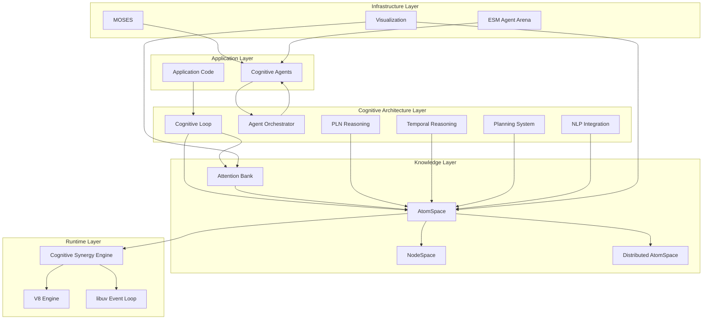

### System Layers

1. **Application Layer**: User code and cognitive agents
2. **Cognitive Architecture Layer**: Autonomous reasoning and orchestration
3. **Knowledge Layer**: Hypergraph knowledge representation
4. **Runtime Layer**: V8/libuv integration with cognitive control
5. **Infrastructure Layer**: Meta-optimization and visualization

## Core Components

### AtomSpace - Hypergraph Knowledge Store

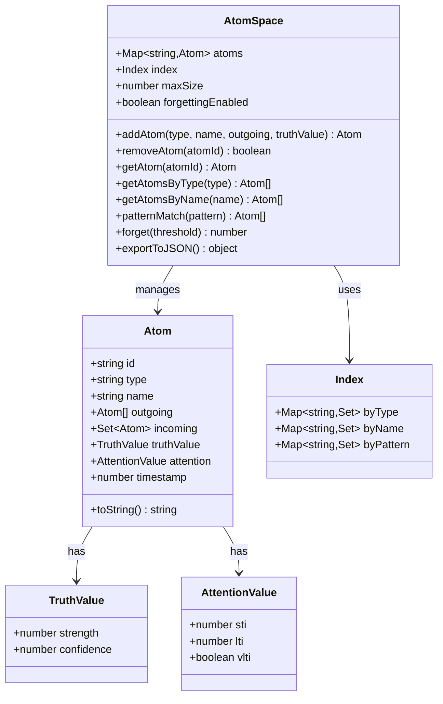

### Attention Bank - Economic Attention Allocation

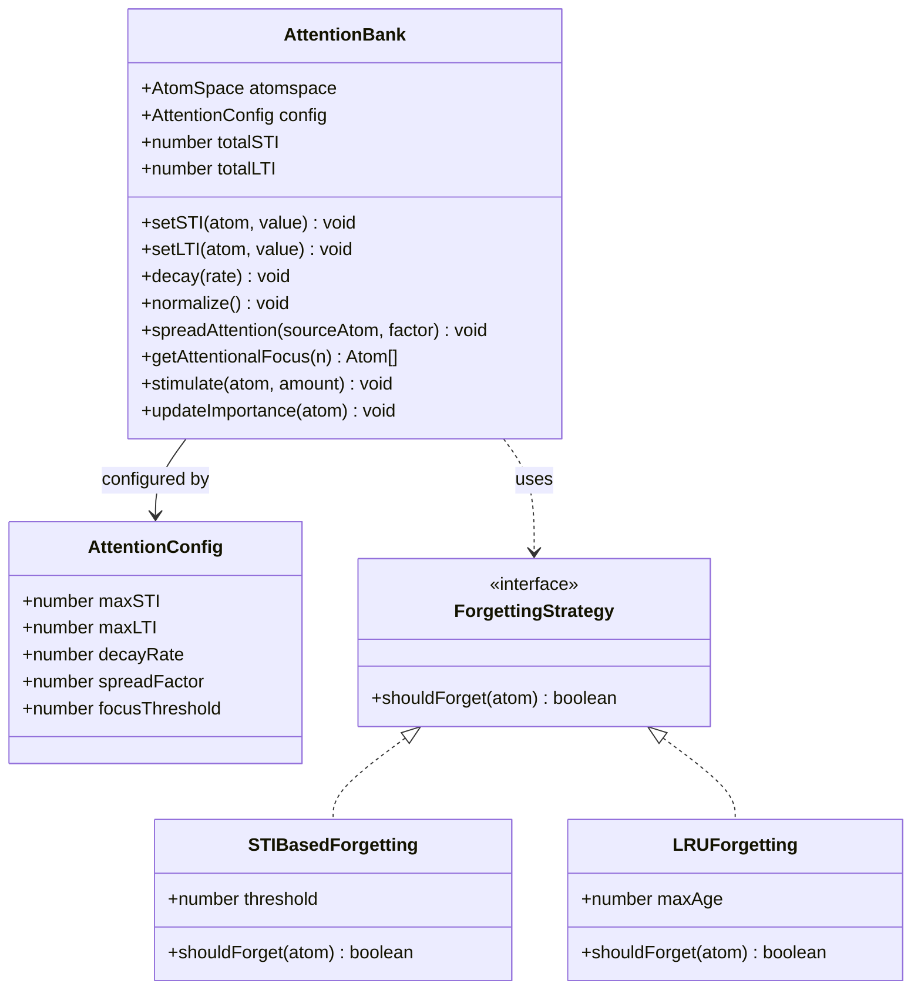

### Agent System - Autonomous Cognitive Agents

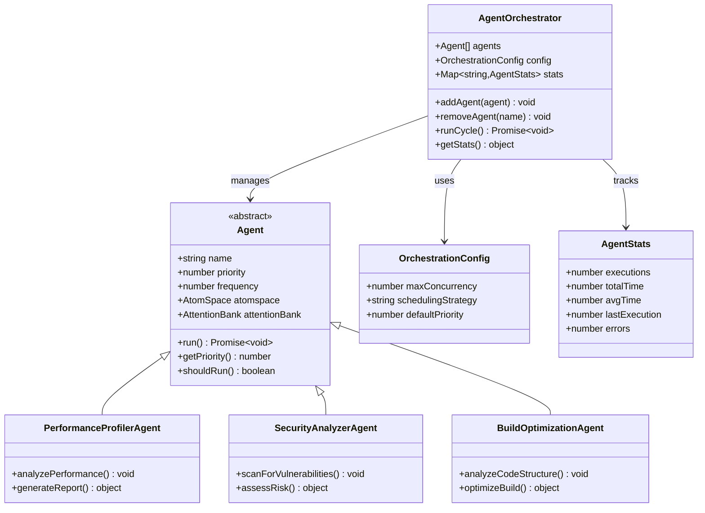

### Cognitive Loop - Autonomous Operation

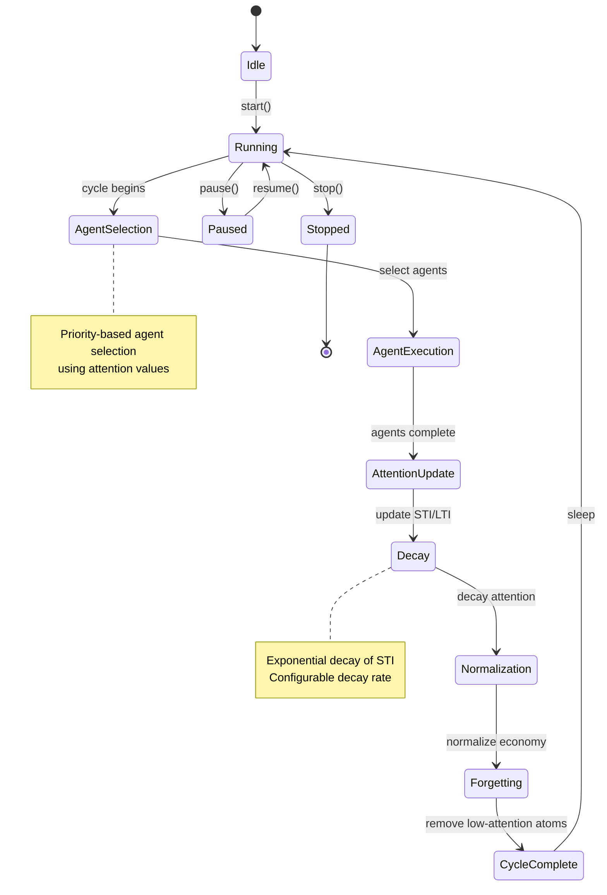

### Distributed AtomSpace - Multi-Node Knowledge Sharing

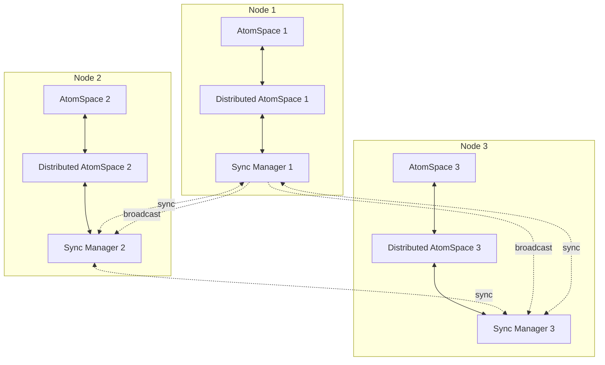

## Formal Specifications

### Z++ Specification for AtomSpace

```z++
schema AtomSpace
  atoms: seq Atom
  index: Index
  maxSize: ℕ
  forgettingEnabled: 𝔹

where
  # Size constraint
  #atoms ≤ maxSize
  
  # Unique atom IDs
  ∀ i, j: dom atoms • i ≠ j ⇒ atoms[i].id ≠ atoms[j].id
  
  # Index consistency
  ∀ a: ran atoms • 
    a.id ∈ index.byType[a.type] ∧
    (a.name ≠ null ⇒ a.id ∈ index.byName[a.name])
end

schema Atom
  id: ID
  type: AtomType
  name: String
  outgoing: seq Atom
  incoming: set Atom
  truthValue: TruthValue
  attention: AttentionValue
  timestamp: ℕ

where
  # Truth value bounds
  0 ≤ truthValue.strength ≤ 1 ∧
  0 ≤ truthValue.confidence ≤ 1
  
  # Attention value bounds
  attention.sti ∈ ℝ ∧
  attention.lti ∈ ℝ ∧
  attention.vlti ∈ 𝔹
  
  # Incoming/outgoing consistency
  ∀ o: ran outgoing • this ∈ o.incoming
  ∀ i: incoming • this ∈ ran i.outgoing
end

schema TruthValue
  strength: [0..1]
  confidence: [0..1]

where
  # Combined certainty constraint
  strength × confidence ≤ 1
end

operation addAtom
  Δ(AtomSpace)
  type?: AtomType
  name?: String
  outgoing?: seq Atom
  truthValue?: TruthValue
  result!: Atom

where
  # Size constraint
  #atoms < maxSize
  
  # Create new atom
  result! = Atom(
    id: generateId(),
    type: type?,
    name: name?,
    outgoing: outgoing? or [],
    truthValue: truthValue? or TruthValue(1.0, 1.0)
  )
  
  # Update atomspace
  atoms' = atoms ⌢ ⟨result!⟩
  
  # Update indices
  index'.byType[type?] = index.byType[type?] ∪ {result!.id}
  name? ≠ null ⇒ 
    index'.byName[name?] = index.byName[name?] ∪ {result!.id}
end
```

### Z++ Specification for Attention Dynamics

```z++
schema AttentionBank
  atomspace: AtomSpace
  config: AttentionConfig
  totalSTI: ℝ
  totalLTI: ℝ

where
  # Conservation of attention
  totalSTI = Σ{a: ran atomspace.atoms • a.attention.sti}
  totalLTI = Σ{a: ran atomspace.atoms • a.attention.lti}
  
  # Bounds
  totalSTI ≤ config.maxSTI
  totalLTI ≤ config.maxLTI
end

schema AttentionConfig
  maxSTI: ℝ₊
  maxLTI: ℝ₊
  decayRate: [0..1]
  spreadFactor: [0..1]
  focusThreshold: ℝ₊
end

operation decay
  Δ(AttentionBank)
  rate?: [0..1]

where
  # Exponential decay of STI
  ∀ a: ran atomspace.atoms •
    a.attention.sti' = a.attention.sti × (1 - (rate? or config.decayRate))
  
  # LTI remains constant
  ∀ a: ran atomspace.atoms •
    a.attention.lti' = a.attention.lti
  
  # Update total
  totalSTI' = totalSTI × (1 - (rate? or config.decayRate))
end

operation spreadAttention
  Δ(AttentionBank)
  source?: Atom
  factor?: [0..1]

where
  source? ∈ ran atomspace.atoms
  
  # Spread to connected atoms
  ∀ a: source?.outgoing ∪ source?.incoming •
    let amount = source?.attention.sti × (factor? or config.spreadFactor)
    a.attention.sti' = a.attention.sti + amount
    source?.attention.sti' = source?.attention.sti - amount
  
  # Preserve total attention
  totalSTI' = totalSTI
end

operation normalize
  Δ(AttentionBank)

where
  # Normalize STI to maxSTI
  let currentTotal = Σ{a: ran atomspace.atoms • a.attention.sti}
  currentTotal > config.maxSTI ⇒
    ∀ a: ran atomspace.atoms •
      a.attention.sti' = a.attention.sti × (config.maxSTI / currentTotal)
  
  # Update total
  totalSTI' = min(totalSTI, config.maxSTI)
end
```

### Z++ Specification for Cognitive Operations

```z++
schema CognitiveLoop
  atomspace: AtomSpace
  attentionBank: AttentionBank
  orchestrator: AgentOrchestrator
  config: LoopConfig
  state: {idle, running, paused, stopped}
  cycleCount: ℕ

where
  state ∈ {idle, running, paused, stopped}
end

schema LoopConfig
  interval: ℕ₊
  autoDecay: 𝔹
  autoNormalize: 𝔹
  autoForget: 𝔹
  decayRate: [0..1]
end

operation runCycle
  Δ(CognitiveLoop)

where
  state = running
  
  # Execute agent orchestration
  orchestrator.runCycle()
  
  # Auto decay if enabled
  config.autoDecay ⇒
    attentionBank.decay(config.decayRate)
  
  # Auto normalize if enabled
  config.autoNormalize ⇒
    attentionBank.normalize()
  
  # Auto forget if enabled
  config.autoForget ⇒
    let threshold = attentionBank.config.focusThreshold
    atomspace.forget(threshold)
  
  # Increment cycle count
  cycleCount' = cycleCount + 1
end

schema AgentOrchestrator
  agents: seq Agent
  config: OrchestrationConfig
  stats: Agent ↦ AgentStats

where
  # All agents have stats
  dom stats = ran agents
  
  # Agents sorted by priority
  ∀ i, j: dom agents • 
    i < j ⇒ agents[i].priority ≥ agents[j].priority
end

operation runCycle
  Δ(AgentOrchestrator)

where
  # Select agents to run
  let runnable = {a: ran agents | a.shouldRun()}
  
  # Execute in priority order with concurrency limit
  ∀ a: runnable •
    a.run()
    stats[a].executions' = stats[a].executions + 1
    stats[a].lastExecution' = now()
end
```

### Z++ Specification for PLN Reasoning

```z++
schema PLNReasoner
  atomspace: AtomSpace
  rules: seq InferenceRule
  config: PLNConfig

where
  # All rules are valid
  ∀ r: ran rules • r.isValid()
end

schema InferenceRule
  name: String
  premises: seq Pattern
  conclusion: Pattern
  formula: TruthValue × seq TruthValue → TruthValue

where
  # Premises and conclusion must be valid patterns
  ∀ p: ran premises • p.isValid()
  conclusion.isValid()
end

schema Pattern
  type: AtomType
  constraints: seq Constraint

where
  # All constraints must be satisfiable
  ∃ a: Atom • matches(a, this)
end

operation forwardChain
  Δ(PLNReasoner)
  maxSteps?: ℕ
  result!: seq Atom

where
  # Apply rules forward until no new atoms or max steps
  let step = 0
  let newAtoms = ∅
  
  while step < (maxSteps? or ∞) ∧ ¬ converged() do
    ∀ r: ran rules •
      let matches = findMatches(r.premises)
      ∀ m: matches •
        let conclusion = applyRule(r, m)
        conclusion ∉ ran atomspace.atoms ⇒
          atomspace.addAtom(conclusion)
          newAtoms' = newAtoms ∪ {conclusion}
    step' = step + 1
  
  result! = newAtoms
end

operation backwardChain
  Δ(PLNReasoner)
  goal?: Atom
  result!: 𝔹

where
  # Try to prove goal by finding matching rules
  goal? ∈ ran atomspace.atoms ∨
  ∃ r: ran rules •
    matches(goal?, r.conclusion) ∧
    ∀ p: r.premises • backwardChain(p)
  
  result! = goal? ∈ ran atomspace.atoms
end
```

## Data Flow Architecture

### Knowledge Flow Diagram

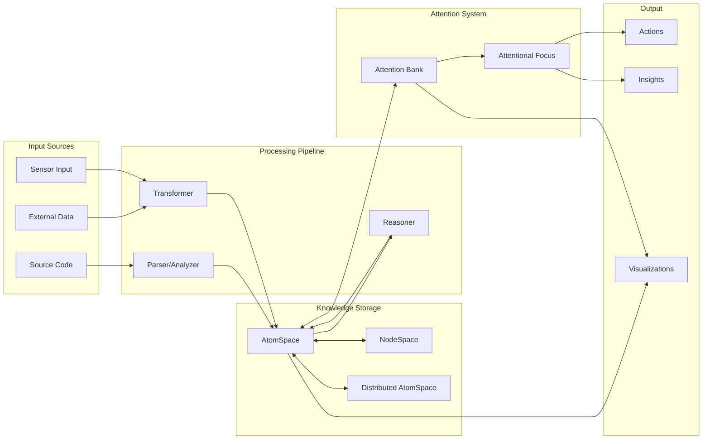

### Attention Spreading Flow

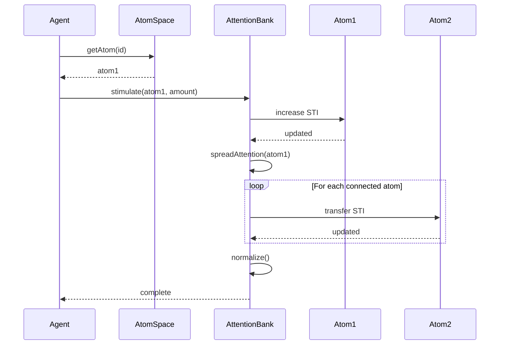

## Deployment Architecture

### Single Node Deployment

```mermaid
deployment
    node "Application Server" {
        component "Node.js Runtime" {
            artifact "V8 Engine"
            artifact "libuv"
            artifact "Cognitive Synergy Engine"
        }
        
        component "Cognitive Architecture" {
            artifact "AtomSpace"
            artifact "Attention Bank"
            artifact "Agent Orchestrator"
        }
        
        component "Application Layer" {
            artifact "User Code"
            artifact "Cognitive Agents"
        }
    }
    
    database "Persistent Storage" {
        artifact "AtomSpace Snapshots"
        artifact "Agent State"
    }
    
    node "Monitoring" {
        component "Visualization Dashboard"
    }
```

### Distributed Deployment

```mermaid
deployment
    node "Node 1" {
        component "AtomSpace 1"
        component "Sync Manager 1"
        component "Agent Set A"
    }
    
    node "Node 2" {
        component "AtomSpace 2"
        component "Sync Manager 2"
        component "Agent Set B"
    }
    
    node "Node 3" {
        component "AtomSpace 3"
        component "Sync Manager 3"
        component "Agent Set C"
    }
    
    node "Coordinator" {
        component "Global Orchestrator"
        component "Sync Coordinator"
    }
    
    database "Shared Knowledge Base" {
        artifact "Global AtomSpace"
    }
    
    cloud "Network" {
    }
    
    Node1 -.-> Network: sync
    Node2 -.-> Network: sync
    Node3 -.-> Network: sync
    Coordinator --> Network: coordinate
    Network --> "Shared Knowledge Base": persist
```

## Interaction Sequences

### Agent Execution Sequence

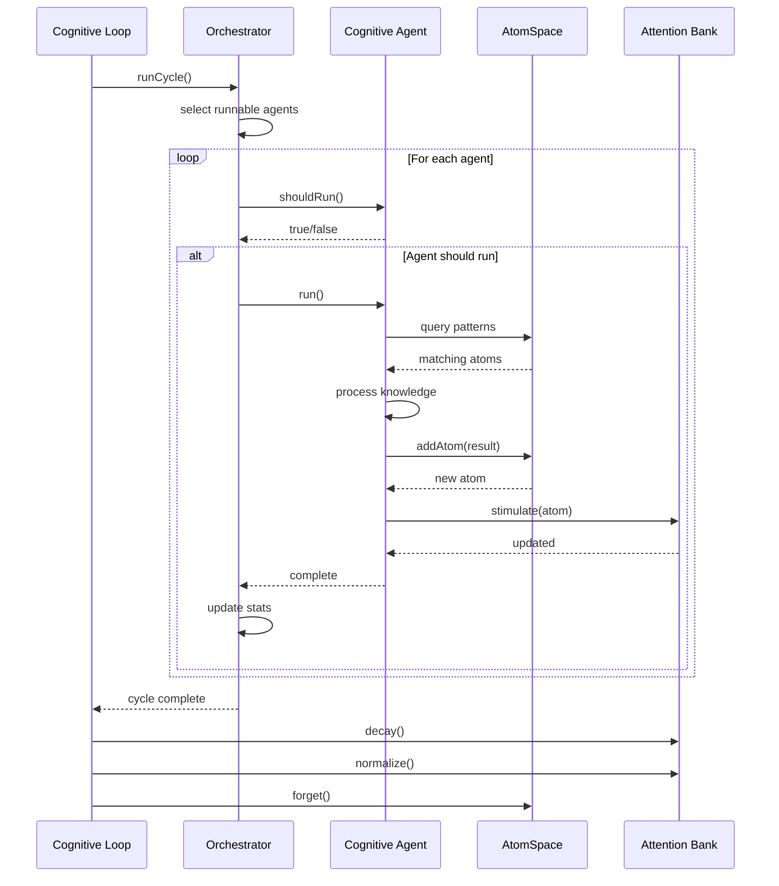

### Pattern Matching Sequence

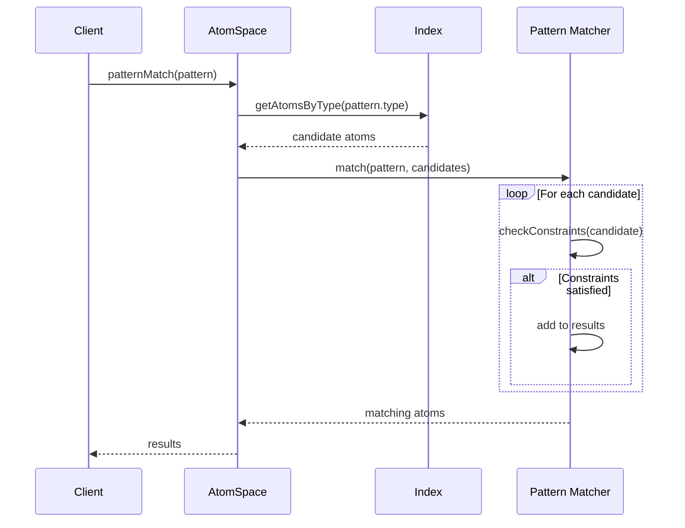

### Distributed Sync Sequence

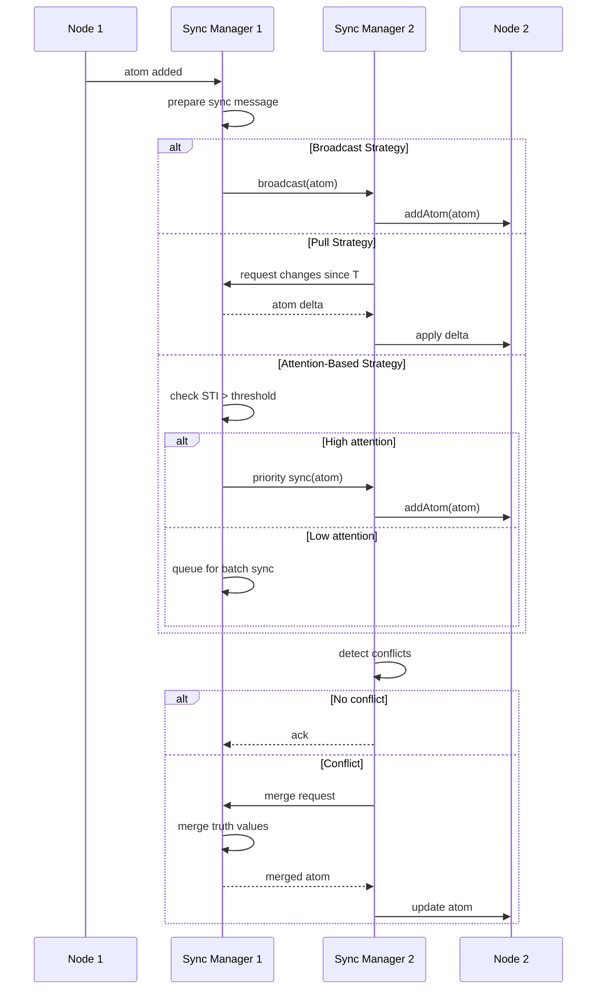

### Reasoning Pipeline Sequence

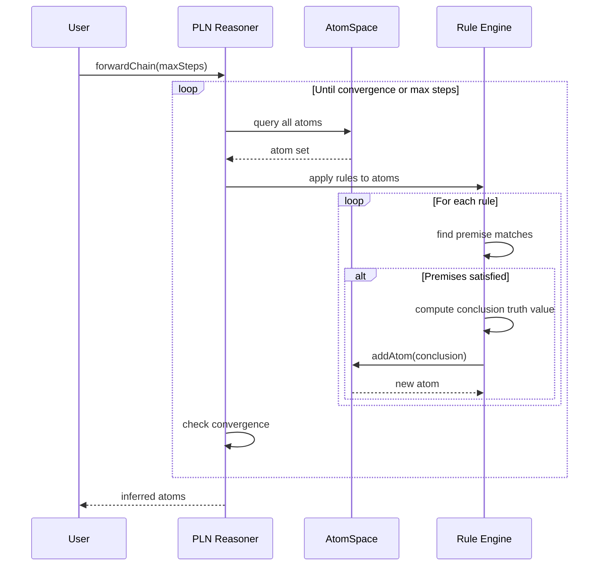

## Performance Characteristics

### Complexity Analysis

| Operation | Time Complexity | Space Complexity |
|-----------|----------------|------------------|
| addAtom | O(1) average | O(1) |
| getAtom | O(1) | O(1) |
| patternMatch | O(n × m) | O(k) |
| spreadAttention | O(d) | O(1) |
| decay | O(n) | O(1) |
| normalize | O(n) | O(1) |
| forget | O(n) | O(1) |
| forwardChain | O(r × n^p) | O(n) |

Where:
- n = number of atoms
- m = pattern complexity
- k = number of matches
- d = degree (connected atoms)
- r = number of rules
- p = max rule premises

### Scalability Metrics

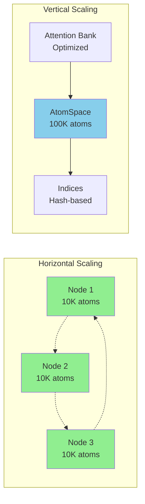

## Security Considerations

### Threat Model

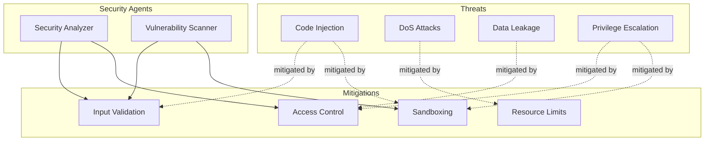

## Appendix

### Glossary

- **Atom**: Basic unit of knowledge in the hypergraph
- **AtomSpace**: Hypergraph knowledge representation system
- **STI**: Short-Term Importance - immediate attention value
- **LTI**: Long-Term Importance - long-term significance value
- **VLTI**: Very Long-Term Importance - protection from forgetting
- **ECAN**: Economic Attention Network - attention allocation mechanism
- **PLN**: Probabilistic Logic Networks - reasoning system
- **MOSES**: Meta-Optimizing Semantic Evolutionary Search

### References

1. OpenCog Framework Documentation
2. V8 JavaScript Engine Architecture
3. libuv Design Overview
4. Hypergraph Theory and Applications
5. Attention Economics in Cognitive Architectures

### Version History

| Version | Date | Changes |
|---------|------|---------|
| 1.0 | 2025-10-30 | Initial comprehensive architecture documentation |

---

**Document Status**: Complete
**Last Updated**: 2025-10-30
**Maintained By**: NodeCog Architecture Team
